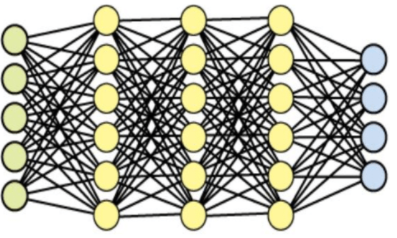

## 프로젝트 배경

### 문제 인식 

---

#### 방언의 중요성

방언은 과거 국어의 흔적을 발견할 수 있다는 데서 가치를 가집니다. 경상도에서는 중세 국어 이전의 형태가 남아 있습니다. 또한 울산방언은 현대 한국어의 근간이 되는 옛 신라어를 잘 간직하고 있다는 점에서 다른 방언과 차별화되는 가치를 가지고 있습니다.언어 전문가들은 언어의 유물인 방언은 국어 역사를 설명하는 데 대단히 중요하고 방언은 지식의 보고라고 말합니다. 나아가 방언은 그것을 사용하는 이들의 존재를 입증하기도 합니다. 방언이 남아 있다는 것은 그 사용자가 존재한다는 것을 전제로 하기 때문입니다. 한국어 연구원 에서는 어떤 형태로든 남아 있는 방언은 그 말을 쓰는 사람의 존재 자체이고 특정 지역, 특정 계층의 방언이 남아 있다는 것은 결국 그것을 쓰는 사람이 있다는 것이라고 방언의 가치를 설명합니다.

---

대부분의 언어 학습 데이터가 표준어로 만들어져 있고 그러한 데이터로 만든 서비스는 표준어로만 사용가능하기 때문에 노년층을 위한 AI 돌봄 서비스나 주로 농촌 지역에서 쓰이게 되는 스마트팜 서비스는 사투리를 인식하는 기능이 필요하다. 

### 프로젝트 선정

방언의 역사적 가치를 이해하고 이 언어를 활용하여 방언을 사용하는 사람들을 위해 방언-표준어 번역기를 만들게 되었습니다.

---

### 프로젝트 목적

지역간 언어적 특성으로 인한 소통의 어려움을 해결하여 지역에 관계없이 원활한 솥몽 할 수 있도록 도와주는 프로그램을 개발

## 프로젝트 수행 절차 및 방법

python 최신버전에선 자연어 처리 이슈 때문에 python 3.6 환경에서 개발 되었습니다.

### 과정 및 개요

---

### 데이터 설명 및 전처리

---

#### 데이터 셋 구축 과정

=======
(출처 - AI hub 데이터 셋)

---

#### 데이터 전처리

---

### ETRI Api 의존 구문 분석

의존 구문분석 API는 자연어 문장의 구조를 분석하는 기술로, 문장 내 각 어절에 대해서 지배소 어절을 인식하고, 주격, 목적격과 같은 세부 의존관계 유형을 인식하는 기술입니다.  의존관계 설정 가이드라인은 세종 구문분석 가이드라인을 기반으로 한 [TTA 표준 의존 구문분석 가이드라인 (TTAK.KO-10.0853)](https://aiopen.etri.re.kr/data/003.의존구문분석_가이드라인.pdf)과 제27회 한글 및 한국어 정보처리 학술대회 논문집의 “의존 구문분석을 위한 한국어 의존관계 가이드라인 및 엑소브레인 언어분석 말뭉치”를 따르고 있습니다.

=======

---

### EDA

**총 데이터의 글자수 빈도수를 나타낸다.**

**품사의 빈도를 나타낸다.**

**2글자 이상의 어절별 빈도수를 나타낸다.**

---

### 과정 및 개요

---

---

### 모델링 과정

---

#### 사용한 딥러닝 모델에 대한 설명

##### DNN

심층 신경망(Deep Neural Network, DNN)은 입력층(input layer) 과 출력층(output layer)사이에 여러 개의 은닉층(hidden layer)들로 이뤄진 인공신경망(Artificial Neural Network, ANN)이다. 심층 신경망은 일반적인 인공 신경망과 마찬가지로 복잡한 비선형 관계(non-linear relationship)들을 모델링 할 수 있다.  비슷하게 수행된 인공신경망에 비해 더 적은 수의 유닛(unit, node)들 만으로도 복잡한 데이터를 모델링할 수 있게 해준다.

**Purpose**

분류 및 수치예측을 하기 위함. 특히, 이미지 트레이닝이나 문자인식과 같은 분야에서 매우 유용하게 쓰이고 있다.

신경망이 작동하는 방법에는 대표적으로 3가지가 있다.

- FFN은 정보들이 input(입력층)에서 hidden(은닉층)으로 hidden(은닉층)에서 output(출력층)으로 쭉 한 방향으로 흐르는 신경망으로써, 오차에 대한 가중치의 조절이 불가능하다.

- 역전파(Backpropagation)의 경우 결과의 오차(실제값과 결과값의 차이)를 줄이기 위해 각 노드에서 다음 노드로 이어지는 가중치를 조절하는 방법이다. 이때 가중치를 조절하기 위해 다시 뒤로 되돌아가기 때문에 역전파라고 한다. 역전파는 FFN에 비해 가중치가 잘 나오는 편이고 또 상대적으로 빠른 편이어서 인공신경망에서 자주 사용한다.

  

- 마지막으로 Recurrent Neural Network, 즉 RNN은 context unit이라는 부분을 통하여 hidden node들과의 교류를 통하여 output nodes를 만들어내는 과정이다. 여기서 context unit은 input과 output node들에는 영향을 미치지 않는다. 이는 주로 주식시장 예측과 같은 Time series 데이터 분석시 이용한다.

  

  **-> 그중 역전파를 차용했다.**

##### Adam Algorithm

아담(Adam)은 Adaptive Moment Estimation의 약자입니다. 모멘텀과 RMSprop을 섞어놓은 최적화 알고리즘 입기 때문에, 딥러닝에서 가장 흔히 사용되는 최적화 알고리즘 입니다.

**Adam Optimization Algorithm**
먼저 초기화를 진행하고, Momentum과 RMSprop에서 사용한 *v*와 *S*를 지정해줍니다.

또한, Momentum에서 소개한 Bias correction을 해주어야 합니다.

마지막으로 Momentum과 RMSprop의 가중치 업데이트 방식을 모두 사용하여 가중치 업데이트를 진행합니다.

##### Translate_model

translate(번역)모델은 입력값으로 사투리 어절과 표준어 어절을 넣어 표준어 어절을 예측하였습니다.

##### synonym_model

synonym(동의어)처리 모델은 형태소 분석을 사용하여 어절과 그와 관련있는 어절의 품사를 같이 집어넣어 동의어가 표준어인지 사투리인지 예측하였습니다.

예측을 할 때 최대값의 인덱스가 아닌 원하는 동의어 어절 두개의 인덱스를 비교해서 큰 값의 인덱스를 가져오는 방식이기 때문에 드러나는 accuracy가 큰 의미를 가지진 않는다.

## 프로젝트 수행 결과

### 결론 

**predict_standard**(**"맞제 이거 약간 모의 투자 느낌."**)

**=>맞지 이거 약간 모의 투자 느낌.**

**predict_standard**(**"최고의 리더는 글을 쓴다."**)

=> **최고의 리더는 글을 쓴다.**

**predict_standard**(**"최고의 리더니까 최고의 글을 쓴다 아이가?"**)

**=>최고의 리더니까 최고의 글을 쓰지 않아?**

**predict_standard**(**"너처럼 어린 아이가 무슨 운전 면허증을 따니?"**)

**=>너처럼 어린 아이가 무슨 운전 면허증을 따니?**

**“맞제 이거 약간 모의 투자느낌”**이라는 문장에서 맞제가 방언으로 인식하여 맞지로 번역되어 나왔습니다.

두번째는 **”최고의 리더는 글을 쓴다.”** 라는 표준어 문장을 넣었을때는 번역을 하지 않고 그대로 나오는것을 확인할수 있습니다.

아래 **"최고의 리더니까 최고의 글을 쓴다 아이가?”**에서 아이가는 방언의 아이가와 아기를 나타내는 아이가 두가지 의미를 지닌 단어입니다. 하지만 앞의 단어들의 품사를 분석하여 아이가와의 관계를 확인하여 쓴다 아이가 전체를 쓰지 않니로 번역하였습니다.마지막 **"너처럼 어린 아이가 무슨 운전 면허증을 따니?”**에서 아이가는 아기의 의미임을 앞의문장 품사들과의 관계로 확인하여 입력값 그대로 나온것을 확인할수 있습니다.

두번째와 세번째에 모두 쓴다 라는 단어가 들어가 있는데 두번째 문장에서 쓴다는 표준어이고 세번째 문장에서 쓴다는 사투리입니다. 두번째 문장에서는 동의어 처리 결과 표준어로 인식되어 쓴다 그대로 출력되었고, 세번째 문장에서 쓴다는 쓴다 아이가? 라는 사투리이기 때문에 동의어 처리 결과 사투리로 인식되어 쓰지 않아? 라고 인식되었습니다.

위와 비슷하게 세번째 문장과 네번째 문장 모두 아이가 라는 단어가 있는데 동의어 처리 결과

세번째 문장에서는 사투리로 인식되어 아이가? 가 않아? 로 번역되었고

네번째 문장에서는 아이가 가 어린아이를 나타내는 표준어로 인식되어 그대로 출력되었습니다.

번역모델이 잘 되지 않는 케이스로는, 

**"게임을 그렇게 대충 해가지고 이기겠나?”는 이기겠나라는 데이터로 학습시켰기 때문에** 이길까?로 잘 번역되었지만아래 **”게임을 그렇게 대충 해가지고 이기긌나?”** 이기긌나는 학습시키는 데이터에 없어 번역 하지 못하고 그대로 나왔습니다.

 **”어릴때 옆집 살던 가는 뭐하냐?”에서 가는을** 가다의(go)로 인식해서 표준어의 가다로 인식하였고 따라서 번역을 제대로 못한것을 확인하였습니다.

#### 기대효과

지능형플랫폼 구축 및 AI 돌봄 서비스, 스마트팜 등 방언 음성 데이터 적용이 가능한 산업분야 및 실생활 AI 서비스 개발에 활용 가능하다.또한 학술적 가치를 지닌 방언을 이해하고 유지 하기위해 데이터를 활용하여 번역기를 만듦으로써번역기 본연의 사용 목적뿐만아니라 사라져 가는 방언의 중요성을 알고 보존하는데 기여할 수 있다.

---

## 패치 예정

제한된 리소스와 리서치의 부족으로 인해 만족하는 결과가 나오지 않아 아쉬웠다.영어와 달리 한국어 자연어처리 특성상 어순이 정해져있지 않아 동의어 처리가 어려웠다. ETRI API의 일일 사용량 제한 때문에 많은 데이터를 사용하지 못하였기 때문에 아쉬웠다. 개선 방향으로충분히 많은 데이터를 학습시켜 번역기의 성능을 개선해 보고 싶습니다. 어절 대신 형태소로 학습시켜 번역기의 성능을 더 높여보고 싶고요,카카오 API를 활용하여 음성인식 및 음성합성을 구현하고 싶습니다. 마지막으로 웹페이지를 만들어서 저희가 만든 번역기를 좀더 잘 소개하고 싶습니다.

### Reference

#### 사용 데이터

한국어 방언 발화(경상도) - 구축 기관(솔트룩스) 

(출처) AI Hub

#### 참고 문헌

임준호, 배용진, 김현기, 김윤정, 이규철, 의존 구문분석을 위한 한국어 의존관계 가이드라인 및 엑소브레인 언어분석 말뭉치, 제27회 한글 및 한국어 정보처리 학술대회 논문집, 2015.10.Martha Palmer, Dan Gildea, Paul Kingsbury, The Proposition Bank: A Corpus Annotated with Semantic Roles Computational Linguistics Journal, 31:1, 2005임수종, 권민정, 김준수, 김현기, ExoBrain을 위한 의미역 가이드라인 및 언어처리 학습데이터 구축, 제27회 한글 및 한국어 정보처리 학술대회 논문집, 2015.10.

---

